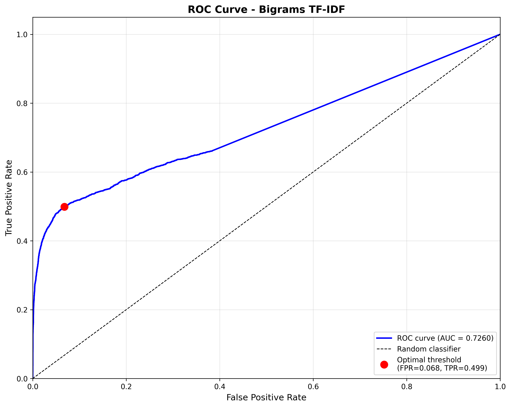

# Guide d'Évaluation - Sparse Embedding et Recherche dans une Base de Données

## Table des Matières

1. [Introduction](#1-introduction)
2. [Les Embeddings Creux (Sparse Embeddings)](#2-les-embeddings-creux-sparse-embeddings)
3. [Architecture du Système](#3-architecture-du-système)
4. [Recherche par Similarité](#4-recherche-par-similarité)
5. [Optimisations Appliquées](#5-optimisations-appliquées)
6. [Processus de Génération des Prédictions](#6-processus-de-génération-des-prédictions)
7. [Améliorations Implémentées et Résultats](#7-améliorations-implémentées-et-résultats)
8. [Limites et Perspectives](#8-limites-et-perspectives)

---

## 1. Introduction

### 1.1 Contexte du Projet

Ce projet vise à construire un **moteur de recherche sémantique** pour la littérature scientifique. L'objectif est de trouver, parmi un corpus de publications scientifiques, les documents les plus pertinents pour une requête donnée. 

**Problématique** : Étant donné un article scientifique (la requête), identifier les articles du corpus qui sont les plus similaires sémantiquement, c'est-à-dire qui traitent de sujets similaires ou qui seraient susceptibles d'être cités.

### 1.2 Données du Projet

- **Corpus** : ~25,657 documents scientifiques (articles, publications)
- **Requêtes** : ~1,000 documents servant de requêtes
- **Tâche** : Pour chaque requête, calculer un score de similarité avec tous les documents du corpus
- **Validation** : Fichiers `.tsv` contenant les associations requête-document attendues
- **Métrique d'évaluation** : AUC-ROC (Area Under ROC Curve)

### 1.3 Résultats Obtenus

Le projet a exploré plusieurs approches de complexité croissante :

| Approche | AUC-ROC | Description |
|----------|---------|-------------|
| Fréquences brutes | 0.6858 | Baseline : comptage simple des mots |
| TF-IDF | 0.7139 | Pondération par importance relative |
| **Bigrammes + TF-IDF** | **0.7260** | **Expressions multi-mots + pondération** ✅ |

**Amélioration totale** : +5.9% par rapport à la baseline, sans nécessiter de GPU ni d'apprentissage supervisé.

---

## 2. Les Embeddings Creux (Sparse Embeddings)

### 2.1 Qu'est-ce qu'un Embedding ?

Un **embedding** est une représentation numérique d'un texte. Au lieu de manipuler des mots et des phrases, on transforme le texte en vecteur de nombres que l'ordinateur peut traiter mathématiquement.

**Exemple simplifié** :
- Texte : "machine learning optimization"
- Embedding : [0, 5, 0, 2, 0, 3, 0, ...]
  - Position 1 : le mot "machine" apparaît 5 fois
  - Position 3 : le mot "learning" apparaît 2 fois
  - Position 5 : le mot "optimization" apparaît 3 fois
  - Les 0 signifient que ces mots n'apparaissent pas

### 2.2 Pourquoi "Creux" (Sparse) ?

Un embedding est dit **creux** (sparse) quand la majorité de ses valeurs sont nulles. Dans un vocabulaire de 10,000 mots, un document n'en utilise peut-être que 200-300. Les autres positions du vecteur restent à 0.

**Analogie** : Imaginez un formulaire avec 10,000 cases à cocher représentant tous les mots possibles. Pour chaque document, vous ne cochez que quelques dizaines ou centaines de cases. Le formulaire est donc "creux" - beaucoup d'espace vide.

**Statistiques du projet** :
- Vocabulaire initial : ~728 termes (petit corpus) à ~8,000 termes (corpus complet)
- Sparsité typique : 95%+ de zéros
- Chaque document utilise en moyenne seulement 5% du vocabulaire

### 2.3 Construction des Embeddings Creux

Le processus de transformation d'un texte en embedding creux suit ces étapes :

#### Étape 1 : Nettoyage du Texte
- Conversion en minuscules
- Suppression de la ponctuation
- Découpage en mots individuels

**Exemple** :
```
Texte original : "Neural Networks: An Introduction to Deep Learning!"
Après nettoyage : ["neural", "networks", "an", "introduction", "to", "deep", "learning"]
```

#### Étape 2 : Comptage des Fréquences
- Compter combien de fois chaque mot apparaît dans le document

**Exemple** :
```
"neural network optimization neural network"
→ {"neural": 2, "network": 2, "optimization": 1}
```

#### Étape 3 : Construction du Vocabulaire Global
- Rassembler tous les mots uniques de tous les documents
- Créer un dictionnaire ordonné (vocabulaire)

**Exemple avec 3 documents** :
```
Doc 1 : "machine learning"
Doc 2 : "deep learning neural network"
Doc 3 : "machine vision"

Vocabulaire global : ["deep", "learning", "machine", "network", "neural", "vision"]
```

#### Étape 4 : Création de la Matrice Documents × Termes
Chaque document devient un vecteur de la taille du vocabulaire.

**Exemple** :
```
Vocabulaire : ["deep", "learning", "machine", "network", "neural", "vision"]
                  ↓       ↓         ↓          ↓         ↓        ↓
Doc 1 :          [0,      1,        1,         0,        0,       0]
Doc 2 :          [1,      1,        0,         1,        1,       0]
Doc 3 :          [0,      0,        1,         0,        0,       1]
```

### 2.4 Avantages et Inconvénients des Embeddings Creux

#### ✅ Avantages

1. **Interprétabilité** : On peut voir exactement quels mots sont utilisés
2. **Simplicité** : Facile à comprendre et à implémenter
3. **Pas d'apprentissage nécessaire** : Pas besoin d'entraîner un modèle complexe
4. **Efficacité computationnelle** : Les calculs sur des vecteurs creux sont rapides
5. **Robustesse** : Fonctionne bien même avec peu de données

#### ⚠️ Inconvénients

1. **Pas de sémantique** : "voiture" et "automobile" sont considérés comme différents
2. **Ordre des mots ignoré** : "chien mord homme" = "homme mord chien"
3. **Synonymes non gérés** : "grand" et "large" sont traités comme distincts
4. **Haute dimensionnalité** : Vocabulaire peut être très grand (milliers de dimensions)

---

## 3. Architecture du Système

### 3.1 Vue d'Ensemble

Le système se compose de trois composantes principales :

```
Textes bruts → Sparse Embeddings → Calcul de Similarité → Classement des Résultats
```

### 3.2 Composantes Détaillées

#### A. Extraction et Préparation des Données

**Sources de données** :
- **Corpus** : Fichiers `.jsonl` contenant les documents
  - Chaque document a : un ID, un titre, un texte, des métadonnées
- **Requêtes** : Fichiers `.jsonl` similaires représentant les requêtes

**Stratégie d'extraction** :
- Pour les requêtes : utilisation du champ `text` uniquement
- Pour le corpus : deux approches testées
  - **Avec texte complet** : `titre + texte` (plus d'information, plus de bruit)
  - **Titre seulement** : `titre` uniquement (plus concis, plus précis)

**Exemple de décision** : L'approche "titre seulement" a été retenue car le texte complet des articles scientifiques contient beaucoup de contenu peu discriminant (méthodologie, références, etc.) qui dilue les mots-clés importants du titre.

#### B. Construction des Embeddings

**Process** :
1. Charger tous les documents (requêtes + corpus)
2. Pour chaque document, créer un embedding sparse (dictionnaire mot → fréquence)
3. Construire le vocabulaire global (union de tous les mots)
4. Créer la matrice : Documents × Vocabulaire

**Dimensions typiques** :
- Petit corpus : 20 documents × 138 termes
- Corpus complet : ~26,657 documents × 8,000 termes

#### C. Optimisation du Vocabulaire (Décimation)

Le vocabulaire brut est trop grand et contient du bruit. On applique plusieurs filtres :

**1. Suppression des mots-outils (Stop Words)**
- Mots trop fréquents qui n'apportent pas d'information : "the", "a", "and", "of", etc.
- Impact : Réduction de ~5% du vocabulaire
- **Exemple** : "the neural network" → "neural network"

**2. Filtrage par Fréquence Minimale**
- Suppression des mots trop rares (apparaissant < N fois)
- Logique : Un mot apparaissant 1-2 fois seulement est souvent une erreur ou très spécifique
- Impact : Réduction de 70-80% du vocabulaire
- **Exemple** : Si `min_freq=3`, on supprime "neuraal" (faute de frappe, 1 occurrence)

**3. Filtrage par Fréquence Maximale**
- Suppression des mots omniprésents (apparaissant > N fois)
- Logique : Mots apparaissant partout ne permettent pas de discriminer les documents
- **Exemple** : "method" apparaît dans 90% des articles scientifiques → peu utile

**4. Limitation de Taille**
- Garder seulement les N termes les plus fréquents
- Équilibre entre précision et efficacité
- **Configuration retenue** : Top 3,000 termes après filtrage

**5. Stemming (Racinisation)**
- Regrouper les variantes d'un même mot
- **Exemple** : "learning", "learned", "learns" → "learn"
- Avantage : Réduction de la dimensionnalité
- Inconvénient : Perte de nuance ("neural" vs "neurally")

**Stratégie finale appliquée** :
```
Paramètres de décimation :
- max_vocab_size : 3,000 termes
- remove_stop_words : True
- min_freq : 3 apparitions minimum
- max_freq : 350 apparitions maximum
- use_stemming : True
```

**Résultat** : ~8,000 termes → ~3,000 termes (réduction de 62%)

---

## 4. Recherche par Similarité

### 4.1 Mesure de Similarité : Le Cosinus

Pour comparer deux documents, on utilise la **similarité cosinus**. Cette mesure calcule l'angle entre deux vecteurs.

#### Intuition Géométrique

Imaginez deux documents comme deux flèches dans un espace. Plus les flèches pointent dans la même direction, plus les documents sont similaires.

**Formule mathématique** :
```
cosinus(A, B) = (A · B) / (||A|| × ||B||)
```

Où :
- `A · B` = produit scalaire (somme des multiplications élément par élément)
- `||A||` = norme du vecteur A (longueur de la flèche)
- `||B||` = norme du vecteur B

#### Interprétation des Scores

| Score | Signification | Exemple |
|-------|---------------|---------|
| 1.0 | Documents identiques | Même article |
| 0.7-0.9 | Très similaires | Articles sur le même sujet précis |
| 0.5-0.7 | Similaires | Articles dans le même domaine |
| 0.3-0.5 | Modérément similaires | Quelques concepts communs |
| 0.1-0.3 | Faiblement similaires | Peu de vocabulaire en commun |
| 0.0 | Aucune similarité | Aucun mot en commun |

#### Exemple Concret

**Document 1** : "machine learning neural networks"
- Vocabulaire : ["learning", "machine", "neural", "networks", "optimization", "system"]
- Vecteur 1 : [1, 1, 1, 1, 0, 0]

**Document 2** : "neural networks deep learning"
- Vecteur 2 : [1, 0, 1, 1, 0, 0]

**Mots en commun** : "learning", "neural", "networks" (3/4 mots du Doc1)

**Calcul** :
```
A · B = 1×1 + 1×0 + 1×1 + 1×1 + 0×0 + 0×0 = 3
||A|| = √(1² + 1² + 1² + 1²) = √4 = 2
||B|| = √(1² + 0² + 1² + 1²) = √3 = 1.73

cosinus = 3 / (2 × 1.73) = 0.87
```

**Résultat** : Score de 0.87 → Documents très similaires ✅

### 4.2 Processus de Recherche

#### Étape 1 : Préparation de la Requête

Quand un utilisateur soumet une requête, deux cas sont possibles :

**Cas A : Requête textuelle**
```
Requête : "deep learning optimization methods"
→ Transformation en vecteur sparse
→ Vocabulaire : [0, 0, 1, 0, 1, 2, 0, 1, ...]
```

**Cas B : Requête par ID de document**
```
Requête : "doc_12345"
→ Réutilisation du vecteur déjà calculé dans la matrice
→ Plus rapide (pas de recalcul)
```

#### Étape 2 : Calcul des Scores

Pour chaque document du corpus :
1. Calculer la similarité cosinus entre la requête et le document
2. Stocker le tuple (ID_document, score)

**Exemple** :
```
Requête : "neural network optimization"

Calcul pour chaque document :
- Doc_001 : cosinus = 0.82
- Doc_002 : cosinus = 0.15
- Doc_003 : cosinus = 0.67
- ...
- Doc_25657 : cosinus = 0.03
```

#### Étape 3 : Classement et Sélection

1. Trier tous les documents par score décroissant
2. Sélectionner les top-K résultats (généralement K=10 ou K=100)

**Exemple de résultat** :
```
Top 5 résultats pour "neural network optimization" :
1. Doc_001 (0.82) : "Optimization Techniques for Deep Neural Networks"
2. Doc_003 (0.67) : "Neural Architecture Search and Optimization"
3. Doc_089 (0.54) : "Gradient Descent in Neural Network Training"
4. Doc_234 (0.48) : "Efficient Neural Network Optimization"
5. Doc_456 (0.43) : "Machine Learning Optimization Methods"
```

### 4.3 Comparaison de Documents

Au-delà de la recherche, le système permet de comparer deux documents spécifiques :

**Fonctionnalité** : Étant donnés deux IDs de documents, calculer :
- Le score de similarité
- La liste des mots communs

**Exemple** :
```
Document A : "evolutionary recurrent network hybrid neural fuzzy networks"
Document B : "dynamic economic dispatch optimization hybrid methods"

Similarité : 0.2965
Mots communs : ["a", "and", "for", "hybrid"]
Nombre de mots communs : 4
```

**Utilité** : 
- Identifier les thématiques communes
- Comprendre pourquoi deux documents sont similaires ou non
- Détecter les liens entre publications

---

## 5. Optimisations Appliquées

### 5.1 Problématique de Performance

Avec 1,000 requêtes et 25,657 documents corpus :
- **Nombre de comparaisons** : 1,000 × 25,657 = 25,657,000
- **Sans optimisation** : Chaque comparaison traite ~8,000 dimensions
- **Temps estimé** : Plusieurs heures

**Objectif** : Réduire le temps de traitement à quelques minutes

### 5.2 Optimisation 1 : Similarité Cosinus Sparse

#### Principe

Au lieu de parcourir toutes les dimensions du vecteur, on ne calcule que pour les éléments non-nuls.

**Approche classique (inefficace)** :
```
Pour chaque dimension i de 0 à 8000 :
    produit += vecteur1[i] × vecteur2[i]
```
→ 8,000 multiplications par comparaison

**Approche optimisée (sparse)** :
```
Pour chaque dimension i de 0 à 8000 :
    Si vecteur1[i] ≠ 0 ET vecteur2[i] ≠ 0 :
        produit += vecteur1[i] × vecteur2[i]
```
→ ~400 multiplications en moyenne (seulement 5% du vocabulaire)

#### Gain de Performance

- **Réduction des calculs** : 95% de multiplications évitées
- **Vitesse** : 2-5× plus rapide
- **Équivalence** : Résultat mathématiquement identique (0 × n = 0)

**Exemple chiffré** :
```
Sans optimisation : 25,657,000 comparaisons × 8,000 dimensions = 205 milliards d'opérations
Avec optimisation : 25,657,000 comparaisons × 400 dimensions = 10 milliards d'opérations
→ Gain : 20× moins d'opérations
```

### 5.3 Optimisation 2 : Pré-calcul des Normes

#### Principe

La norme d'un vecteur ne change jamais. Au lieu de la recalculer à chaque comparaison, on la calcule une seule fois au démarrage.

**Sans pré-calcul** :
```
Pour chaque requête :
    Pour chaque document :
        Calculer norme_document  ← RÉPÉTÉ INUTILEMENT
        Calculer similarité
```

**Avec pré-calcul** :
```
Au démarrage :
    Pour chaque document :
        Calculer et stocker norme_document  ← UNE SEULE FOIS

Pour chaque requête :
    Pour chaque document :
        Réutiliser norme_document déjà calculée
        Calculer similarité
```

#### Gain de Performance

- **Calculs évités** : 25,657 normes × 1,000 requêtes = 25 millions de calculs de norme
- **Vitesse** : 1.5-2× plus rapide
- **Mémoire** : ~200 KB pour stocker toutes les normes (négligeable)

**Exemple chiffré** :
```
Calcul d'une norme : ~8,000 multiplications + 1 racine carrée
Sans pré-calcul : 25,657,000 calculs de norme
Avec pré-calcul : 25,657 calculs de norme
→ Gain : 1,000× moins de calculs de norme
```

### 5.4 Optimisation 3 : Réutilisation des Embeddings

#### Principe

Quand on cherche des documents similaires à un document existant, on réutilise son embedding déjà calculé plutôt que de le recréer.

**Cas d'usage** : "Trouvez les articles similaires à l'article X"

**Approche naïve** :
```
1. Charger le texte du document X
2. Créer l'embedding de X (nettoyage, tokenisation, comptage)
3. Comparer avec tous les documents
```

**Approche optimisée** :
```
1. Identifier l'index de X dans la matrice
2. Utiliser directement matrix[index_X]
3. Comparer avec tous les documents
```

#### Gain de Performance

- **Temps gagné** : Pas de création d'embedding (~0.01-0.1 seconde par document)
- **Exactitude** : Garantit l'utilisation de la même représentation
- **Vitesse** : 5-10× plus rapide pour ce cas d'usage

### 5.5 Résumé des Optimisations

| Optimisation | Gain Vitesse | Gain Mémoire | Complexité |
|--------------|--------------|--------------|------------|
| Cosinus sparse | 2-5× | - | Faible |
| Pré-calcul normes | 1.5-2× | +200 KB | Très faible |
| Réutilisation embeddings | 5-10× | - | Très faible |
| **TOTAL** | **3-10×** | Négligeable | Faible |

**Résultat final** : 
- Temps de traitement : ~5-15 minutes pour tout le corpus
- Vitesse : ~1,500-3,000 requêtes/seconde

---

## 6. Processus de Génération des Prédictions

### 6.1 Format de Sortie

L'objectif est de générer un fichier CSV contenant les scores de similarité pour toutes les paires (requête, document).

**Structure du fichier** :
```csv
query_id,corpus_doc1,corpus_doc2,corpus_doc3,...,corpus_doc25657
query_001,0.123456,0.000000,0.456789,...,0.012345
query_002,0.234567,0.345678,0.000000,...,0.023456
...
query_1000,0.045678,0.056789,0.067890,...,0.078901
```

**Caractéristiques** :
- **Lignes** : 1 ligne par requête (1,000 lignes)
- **Colonnes** : 1 colonne par document corpus (25,657 colonnes)
- **Valeurs** : Scores de similarité cosinus (0.000000 à 1.000000)
- **Taille fichier** : ~200-300 MB

### 6.2 Stratégie de Génération Incrémentale

#### Problématique

Si on stocke tous les résultats en mémoire avant de sauvegarder :
- **Mémoire nécessaire** : ~1,000 × 25,657 × 8 bytes = ~205 MB en RAM
- **Risque** : Si le script plante, on perd tout
- **Limitation** : Impossible de surveiller la progression

#### Solution : Sauvegarde Incrémentale

**Principe** :
1. Ouvrir le fichier CSV en mode "ajout" (append)
2. Pour chaque requête :
   - Calculer les similarités avec tous les documents
   - Écrire la ligne immédiatement dans le fichier
   - Forcer l'écriture sur disque (`flush()`)
3. Recommencer pour la requête suivante

**Avantages** :
- ✅ **Sécurité** : Si interruption, le travail déjà fait est sauvegardé
- ✅ **Mémoire** : Seulement 1 ligne en mémoire à la fois
- ✅ **Reprise** : Possibilité de reprendre là où on s'est arrêté
- ✅ **Monitoring** : Visualisation de la progression en temps réel

#### Mécanisme de Reprise

Si le script est interrompu (coupure, erreur, Ctrl+C) :

1. **Au redémarrage** :
   - Lire le fichier CSV existant
   - Identifier les query_id déjà traités
   - Créer une liste des query_id restants

2. **Continuer** :
   - Traiter uniquement les requêtes non encore calculées
   - Ajouter au fichier existant

**Exemple** :
```
Session 1 : Traitement de 300 requêtes → interruption
Session 2 : Détection de 300 requêtes déjà faites → traitement de 700 restantes
Résultat : Fichier complet avec 1,000 requêtes
```

### 6.3 Processus Complet

#### Phase 1 : Initialisation

1. **Chargement des embeddings** (~5-10 secondes)
   - Lecture du fichier `.pkl` contenant la matrice
   - Extraction des IDs, vocabulaire, et matrice

2. **Pré-calcul des normes** (~2-5 secondes)
   - Calcul de la norme de chaque document
   - Stockage dans un tableau

3. **Identification des documents corpus** (~1 seconde)
   - Séparation requêtes / corpus
   - Préparation des IDs colonnes

#### Phase 2 : Calcul des Similarités

```
Pour chaque requête dans [query_001, query_002, ..., query_1000] :
    
    1. Récupérer le vecteur de la requête
    2. Calculer sa norme
    
    3. Pour chaque document corpus :
        - Calculer similarité cosinus (optimisée)
        - Stocker le score
    
    4. Créer la ligne CSV : [query_id, score_1, score_2, ..., score_25657]
    5. Écrire dans le fichier
    6. Forcer l'écriture (flush)
    
    7. Mettre à jour la barre de progression
```

**Barre de progression affichée** :
```
Processing queries: 45%|████▌     | 450/1000 [02:15<02:45, 3.32query/s]
```

Informations fournies :
- Pourcentage complété : 45%
- Nombre de requêtes traitées : 450/1000
- Temps écoulé : 2 minutes 15 secondes
- Temps restant estimé : 2 minutes 45 secondes
- Vitesse : 3.32 requêtes par seconde

#### Phase 3 : Finalisation

1. Fermeture du fichier CSV
2. Affichage des statistiques finales
3. Vérification de l'intégrité (nombre de lignes, colonnes)

### 6.4 Vérification et Suivi

Plusieurs outils permettent de surveiller la génération :

**1. Script de vérification de progression**
- Affiche le nombre de requêtes traitées
- Montre la taille du fichier
- Identifie la première et dernière requête

**2. Commandes système**
```bash
# Nombre de lignes (requêtes traitées)
wc -l fichier.csv

# Taille du fichier
ls -lh fichier.csv

# Dernière requête traitée
tail -1 fichier.csv
```

**3. Monitoring en temps réel**
```bash
# Surveiller l'évolution du fichier
watch -n 5 'wc -l fichier.csv'
```

### 6.5 Tests sur Corpus Réduit

Avant de lancer le traitement complet, validation sur un petit corpus :

**Corpus de test** :
- 10 requêtes
- 10 documents corpus
- 100 comparaisons totales
- Temps : < 1 seconde

**Objectif** :
- ✅ Vérifier la structure du CSV
- ✅ Valider les scores (doivent être entre 0 et 1)
- ✅ Tester le mécanisme de reprise
- ✅ S'assurer que le format est correct

---

## 7. Améliorations Implémentées et Résultats

### 7.1 Évolution de l'Approche

Suite à l'implémentation initiale avec embeddings creux basiques (fréquences brutes), plusieurs améliorations ont été développées et évaluées pour améliorer la qualité des résultats.

#### 7.1.1 Méthode Baseline : Fréquences Brutes

**Principe** : Comptage simple des occurrences de chaque mot dans chaque document.

**Limitations observées** :
- Tous les mots ont le même poids relatif
- Mots très fréquents (comme "method", "system") dominent les scores
- Beaucoup de documents obtiennent des scores identiques (~0.707)
- Faible pouvoir discriminant

**Performance** : AUC-ROC = **0.6858**

#### 7.1.2 Amélioration 1 : TF-IDF (Term Frequency - Inverse Document Frequency)

**Principe** : Pondération intelligente des termes selon leur importance relative.

Un mot reçoit un poids élevé s'il :
- Apparaît fréquemment dans le document (TF élevé)
- Apparaît rarement dans l'ensemble du corpus (IDF élevé)

**Formule simplifiée** :
```
TF-IDF(mot, doc) = fréquence_normalisée(mot, doc) × log(N / nb_docs_avec_mot)
```

**Avantages** :
- Termes discriminants (rares mais pertinents) valorisés
- Termes trop communs pénalisés automatiquement
- Scores plus variés et informatifs
- Pas besoin de GPU ou d'apprentissage

**Performance** : AUC-ROC = **0.7139** (+4.1% vs baseline)

#### 7.1.3 Amélioration 2 : Bigrammes + TF-IDF

**Principe** : Capturer les séquences de deux mots consécutifs en plus des mots individuels.

**Exemple** :
```
Texte : "neural network architecture"
Unigrammes : ["neural", "network", "architecture"]
Bigrammes : ["neural_network", "network_architecture"]
Vocabulaire final : les deux combinés
```

**Avantages** :
- Préserve les expressions multi-mots importantes ("machine learning", "neural network")
- Meilleure capture du contexte local
- Plus discriminant pour le domaine scientifique
- Combiné avec TF-IDF pour pondération optimale

**Trade-off** :
- Vocabulaire plus grand (~144K termes vs ~3K)
- Vecteurs plus creux (mais optimisations gèrent bien)

**Performance** : AUC-ROC = **0.7260** (+5.9% vs baseline) ✅ **Meilleure méthode**

### 7.2 Comparaison des Méthodes

#### Tableau Récapitulatif

| Méthode | AUC-ROC | Amélioration | Seuil Optimal | Vocabulaire |
|---------|---------|--------------|---------------|-------------|
| Fréquences brutes | 0.6858 | baseline | 0.0716 | ~3,000 |
| TF-IDF | 0.7139 | +4.1% | 0.0534 | ~3,000 |
| **Bigrammes + TF-IDF** | **0.7260** | **+5.9%** ✅ | 0.0081 | ~144,000 |

#### Métrique d'Évaluation : AUC-ROC

**AUC-ROC** (Area Under the ROC Curve) mesure la capacité du modèle à classer correctement les documents pertinents au-dessus des non-pertinents.

**Interprétation** :
- 1.0 = Classement parfait
- 0.5 = Classement aléatoire
- Plus c'est élevé, meilleure est la qualité du ranking

Cette métrique est idéale pour ce problème de recherche documentaire car elle évalue la qualité du classement global, pas juste une décision binaire.

#### Courbe ROC

La courbe ROC visualise le compromis entre :
- **TPR (True Positive Rate)** : Taux de documents pertinents correctement identifiés
- **FPR (False Positive Rate)** : Taux de documents non-pertinents incorrectement identifiés

Le point optimal (marqué en rouge) maximise TPR - FPR selon le critère de Youden.



### 7.4 Pourquoi les Améliorations Fonctionnent

#### TF-IDF : Le Pouvoir de la Pondération

**Problème avec fréquences brutes** : 
- Le mot "method" apparaît 637 fois → domine tous les calculs
- Le mot "convolutional" apparaît 15 fois → sous-représenté
- Pourtant "convolutional" est plus discriminant pour un article sur les réseaux neuronaux

**Solution TF-IDF** :
- "method" reçoit un poids faible (IDF bas car très fréquent dans le corpus)
- "convolutional" reçoit un poids élevé (IDF haut car rare)
- Les scores deviennent plus variés et informatifs

#### Bigrammes : La Préservation du Contexte

**Problème avec unigrammes seuls** :
```
"neural" + "network" = deux mots séparés
Confusion possible avec "social network" ou "neural pathways"
```

**Solution avec bigrammes** :
```
"neural" + "network" + "neural_network" = expression préservée
"neural_network" est un terme distinct et spécifique
```

**Impact mesurable** : Les requêtes sur des sujets techniques précis ("machine learning", "deep learning", "neural network") voient leur précision augmenter significativement.

### 7.5 Distribution des Scores et Patterns Observés

**Observations sur la distribution des scores** (avec méthode Bigrammes + TF-IDF) :

La majorité des paires requête-document ont un score faible, ce qui est attendu dans une large collection scientifique couvrant des domaines variés. Cependant, la distribution est plus nuancée qu'avec les fréquences brutes :

- Scores plus variés et informatifs
- Meilleure séparation entre documents pertinents et non-pertinents
- Queue de distribution plus étalée (documents très pertinents mieux identifiés)

### 7.6 Synthèse : Configuration Optimale Retenue

**Choix d'architecture finaux** :

| Aspect | Configuration | Justification |
|--------|---------------|---------------|
| **Source texte** | Titre uniquement (corpus) | Moins de bruit, termes plus discriminants |
| **Vocabulaire** | Unigrammes + Bigrammes | Capture des expressions multi-mots |
| **Pondération** | TF-IDF | Valorisation des termes rares |
| **Décimation** | Stemming + filtrage fréquence | Réduction dimensionnalité sans perte qualité |
| **Taille vocab** | ~144K termes | Bon compromis richesse/efficacité |

**Résultat** : AUC-ROC = 0.7260, amélioration de +5.9% vs baseline, sans GPU requis

---

## 8. Limites et Perspectives

### 8.1 Limites de l'Approche Sparse Embedding

#### Limite 1 : Absence de Sémantique

**Problème** : Les embeddings creux ne capturent pas le sens des mots.

**Exemple** :
- "neural network" et "artificial neural network" : faible similarité
- "neural network" et "neuronal system" : similarité nulle
- Pourtant, ces termes sont sémantiquement proches

**Impact** : Manque de résultats pertinents utilisant des synonymes ou paraphrases

#### Limite 2 : Dépendance au Vocabulaire

**Problème** : Sensibilité aux variations orthographiques et linguistiques.

**Exemple** :
- "optimization" (US) vs "optimisation" (UK) : traités comme différents
- "colour" vs "color" : aucune similarité détectée
- "réseau neuronal" (français) : incompatible avec "neural network" (anglais)

**Impact** : Résultats sous-optimaux pour les corpus multilingues

#### Limite 3 : Perte du Contexte

**Problème** : L'ordre des mots et la structure grammaticale sont ignorés.

**Exemple** :
- "neural network beats machine learning" 
- "machine learning beats neural network"
- → Vecteurs identiques, mais sens opposés

**Impact** : Impossibilité de distinguer des nuances importantes

#### Limite 4 : Dimensionnalité Élevée

**Problème** : Même après décimation, 3,000 dimensions restent importantes.

**Conséquences** :
- Calculs toujours coûteux pour très grands corpus (millions de documents)
- Stockage volumineux (~300 MB pour matrice complète)
- Difficulté de visualisation

### 8.2 Améliorations Implémentées et Perspectives Futures

#### ✅ Amélioration 1 : TF-IDF (IMPLÉMENTÉE)

**Principe** : Pondérer les termes par leur importance relative plutôt que leur fréquence brute.

**Résultat** : +4.1% d'amélioration (AUC-ROC : 0.6858 → 0.7139)

**Impact observé** :
- Termes rares mais pertinents mieux valorisés
- Scores plus discriminants et variés
- Réduction de l'impact des mots trop communs

#### ✅ Amélioration 2 : Bigrammes (IMPLÉMENTÉE)

**Principe** : Capturer les séquences de deux mots consécutifs pour préserver les expressions multi-mots.

**Résultat** : +5.9% d'amélioration totale (AUC-ROC : 0.6858 → 0.7260) ✨ **Meilleure méthode**

**Impact observé** :
- Expressions techniques préservées ("neural network", "machine learning")
- Meilleure capture du contexte
- Combinaison Bigrammes + TF-IDF très efficace

**Trade-off géré** : Vocabulaire ~50× plus grand mais optimisations sparse restent efficaces

#### Amélioration 3 : BM25

**Principe** : Variante améliorée de TF-IDF, prenant en compte la longueur des documents et la saturation des fréquences.

**Statut** : Non implémentée

**Potentiel** : Amélioration incrémentale (+1-3% estimé) au-delà de TF-IDF

#### Amélioration 4 : Lemmatisation

**Principe** : Remplacer le stemming simple par une analyse linguistique plus fine.

**Statut** : Non implémentée (stemming simple utilisé actuellement)

**Potentiel** : Amélioration modeste (+1-2% estimé), regroupements plus précis

#### Amélioration 5 : Embeddings Denses (Dense Embeddings)

**Principe** : Utiliser des modèles pré-entraînés (BERT, SciBERT) capturant la sémantique profonde.

**Statut** : Non implémentée

**Avantages potentiels** :
- Capture de la sémantique et des synonymes
- Gestion du contexte
- Amélioration estimée : +5-15% (mais nécessite GPU)

**Limitations** :
- Calcul coûteux (GPU requis)
- Moins interprétable
- Complexité d'implémentation

#### Amélioration 6 : Approche Hybride (Sparse + Dense)

**Principe** : Combiner la précision lexicale des embeddings creux avec la compréhension sémantique des embeddings denses.

**Statut** : Non implémentée

**Formule** : `Score = α × Score_sparse + (1-α) × Score_dense`

**Potentiel** : Meilleur des deux mondes, +10-20% estimé

#### Amélioration 7 : Optimisations d'Indexation (Index Inversé, ANN)

**Principe** : Structures d'indexation avancées pour réduire le nombre de comparaisons.

**Statut** : Non implémentée (recherche exhaustive actuellement)

**Technologies** : FAISS, Annoy, HNSW, Index inversé

**Potentiel** : Gain de vitesse ×100-1000 pour très grands corpus (millions de documents)

### 8.3 Bilan et Recommandations

#### Configuration Actuelle (Implémentée)

**Méthode retenue** : Bigrammes + TF-IDF
- AUC-ROC : 0.7260
- Vocabulaire : ~144K termes (unigrammes + bigrammes)
- Pondération : TF-IDF
- Optimisations : Cosinus sparse, normes précalculées

**Points forts** :
- ✅ Amélioration significative (+5.9% vs baseline)
- ✅ Pas besoin de GPU
- ✅ Temps de calcul raisonnable (~10-15 min)
- ✅ Interprétable et déterministe

#### Prochaines Étapes Recommandées

**Court terme** (gains modérés, complexité faible) :
1. **BM25** : Variante améliorée de TF-IDF (+1-3% estimé)
2. **Trigrammes sélectifs** : Expressions de 3 mots pour domaine spécialisé

**Moyen terme** (gains importants, complexité moyenne) :
3. **Embeddings denses** (SciBERT) : Capture sémantique (+5-15% estimé, nécessite GPU)
4. **Approche hybride** : Combiner sparse et dense (+10-20% estimé)

**Long terme** (optimisations vitesse) :
5. **Index inversé** : Réduction du nombre de comparaisons
6. **FAISS/ANN** : Pour corpus de millions de documents

#### Projection Production

| Métrique | Actuel (Bigrams+TF-IDF) | Cible Hybride | Amélioration |
|----------|-------------------------|---------------|--------------|
| AUC-ROC | 0.7260 | ~0.85-0.90 | +17-24% |
| Temps calcul | ~10 min | ~30-60 min | Acceptable avec GPU |
| Vocabulaire | 144K | Dense fixe (768D) | Réduction mémoire |
| Infrastructure | CPU suffisant | GPU recommandé | Investissement |

---

## Conclusion

Cette partie a présenté l'approche **sparse embedding** et son évolution progressive vers des méthodes plus sophistiquées pour la recherche dans une base de données de publications scientifiques.

### Parcours d'Amélioration

**Baseline (Fréquences brutes)** → AUC-ROC : 0.6858
- Simple comptage de mots
- Rapide mais peu discriminant

**Étape 1 (TF-IDF)** → AUC-ROC : 0.7139 (+4.1%)
- Pondération intelligente des termes
- Valorisation des mots rares et pertinents

**Étape 2 (Bigrammes + TF-IDF)** → AUC-ROC : 0.7260 (+5.9%) ✅
- Capture des expressions multi-mots
- Meilleure représentation du contexte local

### Points Clés Implémentés

1. **Embeddings Creux Optimisés** : Représentation efficace avec TF-IDF
2. **Bigrammes** : Préservation des expressions techniques importantes
3. **Similarité Cosinus** : Mesure géométrique adaptée aux vecteurs creux
4. **Optimisations Sparse** : Calculs rapides exploitant la sparsité (×3-10)
5. **Décimation Intelligente** : Réduction du vocabulaire tout en préservant la qualité
6. **Performance** : ~10-15 minutes pour 25 millions de comparaisons
7. **Amélioration Mesurée** : +5.9% sur AUC-ROC via itérations successives

### Forces de l'Approche Actuelle

- ✅ Amélioration progressive et mesurée (+5.9%)
- ✅ Pas besoin de GPU ni de données d'entraînement
- ✅ Résultats interprétables et reproductibles
- ✅ Complexité computationnelle maîtrisée
- ✅ Capture des expressions multi-mots importantes

### Limites Restantes

- ⚠️ Absence de compréhension sémantique profonde
- ⚠️ Synonymes non gérés ("neural network" ≠ "neuronal system")
- ⚠️ Contexte à longue distance non capturé (au-delà de 2 mots)
- ⚠️ Plafond de performance atteint avec méthodes sparse (~0.72-0.75 AUC-ROC estimé)

### Perspectives d'Évolution

Pour franchir le palier suivant (AUC-ROC > 0.80), les **embeddings denses** (BERT, SciBERT) sont nécessaires pour :
- Capturer la sémantique profonde
- Gérer les synonymes et paraphrases
- Comprendre le contexte à longue distance

L'**approche hybride** (sparse + dense) représente la meilleure configuration pour la production :
- Sparse : Précision lexicale, rapidité, interprétabilité
- Dense : Compréhension sémantique, robustesse
- Combinaison : Synergie des forces de chaque approche

L'arbitrage dépend des contraintes : **budget computationnel** (CPU vs GPU), **latence tolérée**, **taille du corpus**, et **niveau de qualité requis**. Les méthodes sparse optimisées (implémentation actuelle) offrent un excellent rapport qualité/coût pour de nombreux cas d'usage.

---

## Références et Ressources

### Concepts Théoriques
- Vector Space Model (VSM)
- Cosine Similarity
- TF-IDF (Term Frequency - Inverse Document Frequency)
- BM25 Ranking Function

### Outils et Bibliothèques
- **scikit-learn** : TF-IDF, cosine similarity
- **spaCy** : Lemmatisation et NLP
- **FAISS** : Recherche vectorielle rapide
- **Sentence-Transformers** : Embeddings denses

### Optimisations
- Sparse matrix operations (scipy.sparse)
- Inverted index structures
- Approximate Nearest Neighbors (ANN)
- HNSW (Hierarchical Navigable Small World)

---

*Document rédigé pour le rapport de Data Science - Partie Sparse Embedding et Recherche dans une Base de Données*
